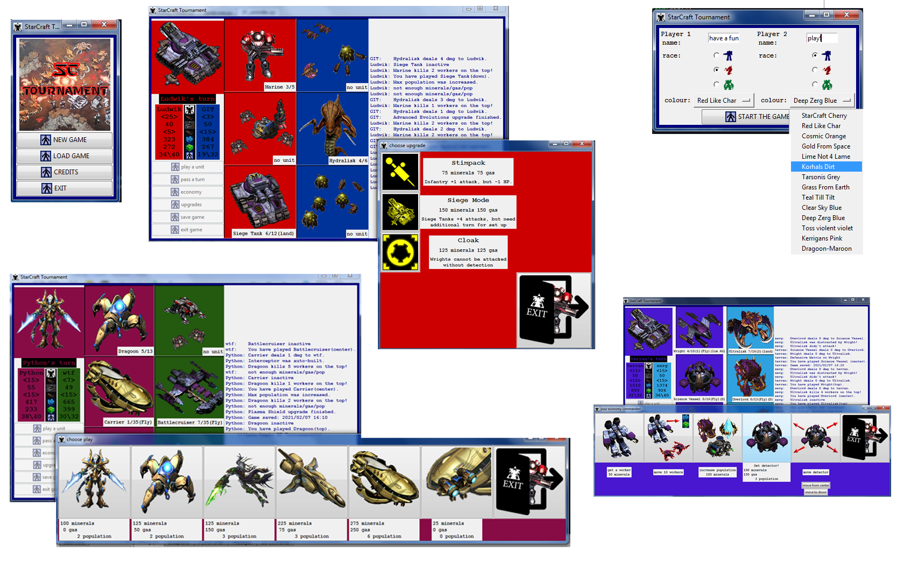

# StarCraft Tournament 
:rocket::rocket::rocket: version beta 5.0 :rocket::rocket::rocket:

:rocket::rocket::rocket: fully functional :rocket::rocket::rocket:

## What is it?
StarCraft Tournament is a simple 2 players desktop game.

Most inspirations and pictures from: *StarCraft: Broodwar* and *StarCraft remastered*

## Gameplay
Each player chooses a race he commands.

Each turn a player can play a single unit (additional actions like upgrades are not resstricted to 1 pr turn)

At the end of a turn a player produces resources and units attack respective units on the opposite side:
 * top and bottom units attacks the opponent economy (if no unit present on  the opponent side of the board)
 * unit on the center attacks directly opponent base (if no enemy unit on the center)
 * A player wins the game when oponent's base is destroyed.
 
As in the original game units have abilities. 
 * Cloaked units can be attacked only if the detector is present on the board
 * Flying units can be attacked only by ranged units
 * Ultralisk has armour, Carrier builds interceptors, Lurkers evolves from Hydras and many more.
 * Yes, now you can launch a NUKE  :rocket:  

## Technology
Game written in Python 3.
It uses Tkinter for visuals, jsonpickle for data serialisation, and vlc for music.

## Contributers
**Ludwik R. Papaj** <ludwikpapaj@gmail.com>

## License & copyright:
©Ludwik R. Papaj

